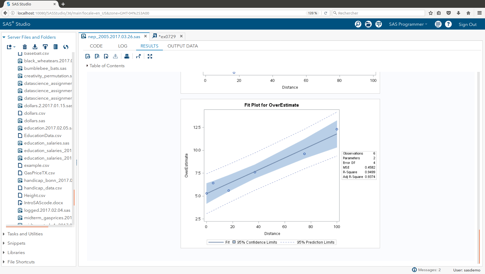
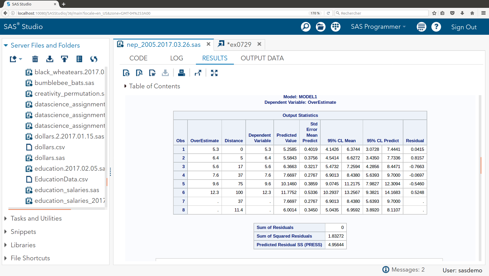
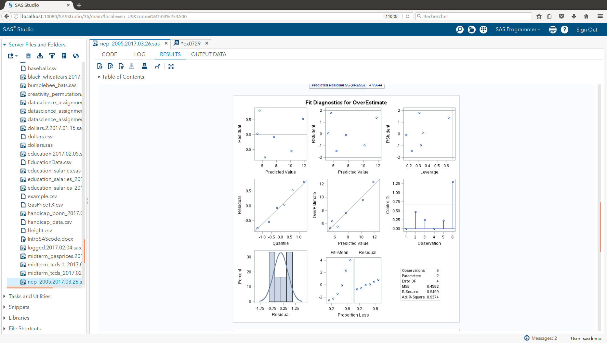

```{r setup, include=FALSE}
knitr::opts_chunk$set(echo = TRUE)
```

## Edison - Mitofsky Election Results


```{r read in data set, echo = FALSE}

HOME_DIR <- "/home/mcdevitt/_smu/_src/NEP_2005"

DATA_DIR <- "./data/"

setwd(HOME_DIR)
setwd(DATA_DIR)


df_nep <- read.csv("ex0729.csv", stringsAsFactors = FALSE)

names(df_nep) <- tolower(names(df_nep))

```

### Homework 10 - NEP 2005 Evaluation

#### b. Analyze the data providing at least the following:    

=-=-=-=-=-=-=-=-=-=-=-=-=-=-=-=-=-=-=-=-=-=-=-=-=-=-=-=-=-=-=-=-=-=-=-=--=-=-=-  
### __ i. A Scatterplot with confidence intervals of the regression line and prediction intervals of the regression line.  Please do in SAS and R! __      
```{r, echo = FALSE}


fit_all <- lm(overestimate ~ distance, data = df_nep)

df_nep_conf_int <- as.data.frame(predict(fit_all, df_nep , interval = "confidence"))

plot(df_nep$overestimate ~ df_nep$distance, col = 'blue', pch = 19)
polygon(c(df_nep$distance, rev(df_nep$distance)),
		c(df_nep_conf_int$lwr, rev(df_nep_conf_int$upr)),col="lightgrey")

lines(fit_all$fitted.values ~ df_nep$distance, col = 'black', lwd = 4, lty = 3)

lines(df_nep_conf_int$lwr ~ df_nep$distance, col = 'black', lwd = 1)
lines(df_nep_conf_int$upr ~ df_nep$distance, col = 'black', lwd = 1)

points(df_nep$overestimate ~ df_nep$distance, col = 'blue', pch = 19)

df_nep_pred_int <- as.data.frame(predict(fit_all, df_nep, interval = "predict"))

lines(df_nep_pred_int$lwr ~ df_nep$distance, col = 'grey', lwd = 1, lty = 2)
lines(df_nep_pred_int$upr ~ df_nep$distance, col = 'grey', lwd = 1, lty = 2)

```

And the SAS plot ...


=-=-=-=-=-=-=-=-=-=-=-=-=-=-=-=-=-=-=-=-=-=-=-=-=-=-=-=-=-=-=-=-=-=-=-=--=-=-=-  
### __ii. A table showing the t-statistics and pvalues for the significance of the regression parameters: .   Please do in SAS and R!__  

```{r plot, echo=FALSE}

summary(fit_all)

```

And the SAS table ...


=-=-=-=-=-=-=-=-=-=-=-=-=-=-=-=-=-=-=-=-=-=-=-=-=-=-=-=-=-=-=-=-=-=-=-=--=-=-=-  
### __iii. Using the data in ii show all 6 steps of each hypothesis test.__  
=-=-=-=-=-=-=-=-=-=-=-=-=-=-=-=-=-=-=-=-=-=-=-=-=-=-=-=-=-=-=-=-=-=-=-=--=-=-=-  

#### __Six-Step Hypothesis Test - Slope__   

``` {r, echo = FALSE}

alpha <- 0.05
dof <- dim(df_nep)[1] - 2
crit_value <- qt(1 - alpha/2, dim(df_nep)[1] - 2)

t_value <- coef(summary(fit_all))["distance","t value"]
p_value <- coef(summary(fit_all))["distance","Pr(>|t|)"]

if (p_value < alpha)
{
	acc_rej <- "Reject Ho"
	is_is_not <- "is"
	does_does_not <- "does not"
} else {
	acc_rej <- "Do not Reject Ho"
	is_is_not <- "is not"
	does_does_not <- "does"
}

cnf_intrvl <- confint(fit_all, 'distance', level = 1 - alpha)
cnf_intrvl_lwr <- cnf_intrvl[1,1]
cnf_intrvl_upr <- cnf_intrvl[1,2]

print_cnf_intrvl <- paste0(sprintf("(%9.3f", cnf_intrvl_lwr), sprintf(", %9.3f)", cnf_intrvl_upr))

```

1: Ho : b1 = 0; Ha ; b1 != 0  
2 : Critical Value : t(0.975, df = __`r dof `__) = +/- __`r crit_value`__   
3 : t = `r t_value `    
4 : p_value = `r p_value` < 0.05 ?    
5: `r acc_rej`  
6 : There `r is_is_not` sufficient evidence to suggest at the alpha = `r alpha` level of significance (p-value = `r p_value`) that the slope of the regression line that estimates the OverEstimate for NEP 2005 based on the Polling Distance `r is_is_not` equal to zero. A `r (1 - alpha)*100`% confidence interval for the slope is `r print_cnf_intrvl`, which is an interval that `r does_does_not` contain the value zero  
  

#### __Six-Step Hypothesis Test - Intercept__   

``` {r, echo = FALSE}

alpha <- 0.05
dof <- dim(df_nep)[1] - 2
crit_value <- qt(1 - alpha/2, dim(df_nep)[1] - 2)

t_value <- coef(summary(fit_all))["(Intercept)","t value"]
p_value <- coef(summary(fit_all))["(Intercept)","Pr(>|t|)"]

if (p_value < alpha)
{
	acc_rej <- "Reject Ho"
	is_is_not <- "is"
	does_does_not <- "does not"
} else {
	acc_rej <- "Do not Reject Ho"
	is_is_not <- "is not"
	does_does_not <- "does"
}

cnf_intrvl <- confint(fit_all, '(Intercept)', level = 1 - alpha)
cnf_intrvl_lwr <- cnf_intrvl[1,1]
cnf_intrvl_upr <- cnf_intrvl[1,2]

print_cnf_intrvl <- paste0(sprintf("(%9.3f", cnf_intrvl_lwr), sprintf(", %9.3f)", cnf_intrvl_upr))

```

1 : Ho : b0 = 0; Ha ; b0 != 0  
2 : Critical Value : t(0.975, df = __`r dof `__) = +/- __`r crit_value`__   
3 : t = `r t_value `    
4 : p_value = `r p_value` < 0.05 ?    
5: `r acc_rej`  
6 : There `r is_is_not` sufficient evidence to suggest at the alpha = `r alpha` level of significance (p-value = `r p_value`) that the intercept of the regression line that estimates the OverEstimate for NEP 2005 based on the Polling Distance is not equal to zero. A `r (1 - alpha)*100`% confidence interval for the slope is `r print_cnf_intrvl`, which is an interval that `r does_does_not` contain the value zero  
  


=-=-=-=-=-=-=-=-=-=-=-=-=-=-=-=-=-=-=-=-=-=-=-=-=-=-=-=-=-=-=-=-=-=-=-=--=-=-=-  
### __iv. The regression equation.__  


``` {r, echo = FALSE}

b0 <- fit_all$coefficients[1]
b1 <- fit_all$coefficients[2]

```

The Regression equation : 
- overestimate = `r b1` * distance + `r b0`


=-=-=-=-=-=-=-=-=-=-=-=-=-=-=-=-=-=-=-=-=-=-=-=-=-=-=-=-=-=-=-=-=-=-=-=--=-=-=-  
### __v. Interpretation of the slope and intercept in the model (regression equation.)__   

##### The slope represents the rate of change in overestimate estimated for a unit change in poll distance . I.e., for each increase in 1 foot of poll distance there is a corresponding increase in overestimate by `r b1` percentage points

##### The intercept represents the estimated average level of overestimate percentage pointss associated to a polling distance of 0 feet from this sample study. From a practical point of view, since there were some polling distance experience of 0 feet, the intercept provides an estimate of the mean overestimate percentage expected for the population represented from this sample study.

=-=-=-=-=-=-=-=-=-=-=-=-=-=-=-=-=-=-=-=-=-=-=-=-=-=-=-=-=-=-=-=-=-=-=-=--=-=-=-  
### __vi. Find and interpret the 95% confidence interval for the mean overestimate response conditional on a poll distance of 37 feet.  Please do in SAS and R!__  

``` {r, echo = FALSE} 

cnf_intrvl <- predict(fit_all, data.frame(distance = 37) , interval = "confidence")
cnf_intrvl_lwr <- cnf_intrvl[1,2]
cnf_intrvl_upr <- cnf_intrvl[1,3]

print_cnf_intrvl <- paste0(sprintf("(%9.3f", cnf_intrvl_lwr), sprintf(", %9.3f)", cnf_intrvl_upr))

```


The confidence interval is the upper and lower bound for the expected mean value at the given indpendent value (e.g., distance = 37 feet) for the current regression relationship.

For this particular regression, the confidence interval at poll distance = 37 : overestimate percentage points in the range `r print_cnf_intrvl`
  
=-=-=-=-=-=-=-=-=-=-=-=-=-=-=-=-=-=-=-=-=-=-=-=-=-=-=-=-=-=-=-=-=-=-=-=--=-=-=-  
### __vii. Find and interpret the 95% prediction interval for the predicted overestimate response given a poll distance of 37 feet.   Please do in SAS and R!__  


``` {r, echo = FALSE} 

prd_intrvl <- predict(fit_all, data.frame(distance = 37) , interval = "predict")
prd_intrvl_lwr <- prd_intrvl[1,2]
prd_intrvl_upr <- prd_intrvl[1,3]

print_prd_intrvl <- paste0(sprintf("(%9.3f", prd_intrvl_lwr), sprintf(", %9.3f)", prd_intrvl_upr))

```


The prediction interval is the upper and lower bound for an 'next' observation of dependent value at the given independent value, based on the current regression relationshhip. That is to say, for an observation of distance and overestimate not included in this analysis, the prediction interval bounds the range of future observations that are expected.  

For this particular case, the prediction interval at poll distance = 37 : overestimate percentage points in the range `r print_prd_intrvl`


And the SAS table ...


=-=-=-=-=-=-=-=-=-=-=-=-=-=-=-=-=-=-=-=-=-=-=-=-=-=-=-=-=-=-=-=-=-=-=-=--=-=-=-  
### __viii. Using the graphical method, find and interpret the calibration intervals for the overestimate response of 6.0 feet. (Both for mean overestimate response and for a single overestimate response.   Please do in SAS and R!  (R: package investr)__  

``` {r, echo = FALSE}

# ... create data frame with equal interval x-axis values

y_est <- 6.0

df_distance <- as.data.frame(seq(from = -30, to = 200, by = 5))
names(df_distance) <- "distance"

plot(df_nep$overestimate ~ df_nep$distance,
	 col = 'blue',
	 pch = 1,
	 xlim = c(-30, 50),
	 ylim = c(0, 10)
	 )

abline(v = seq(-30, 100, 5), col = "gray", lty = 3)

polygon(c(df_nep$distance, rev(df_nep$distance)),
		c(df_nep_conf_int$lwr, rev(df_nep_conf_int$upr)),col="lightgrey")

lines(fit_all$fitted.values ~ df_nep$distance, col = 'black', lwd = 4, lty = 3)

lines(df_nep_conf_int$lwr ~ df_nep$distance, col = 'black', lwd = 1)
lines(df_nep_conf_int$upr ~ df_nep$distance, col = 'black', lwd = 1)

points(df_nep$overestimate ~ df_nep$distance, col = 'blue', pch = 1)

df_nep_pred_int <- as.data.frame(predict(fit_all, df_distance, interval = "predict"))

lines(df_nep_pred_int$lwr ~ df_distance$distance, col = 'grey', lwd = 1, lty = 2)
lines(df_nep_pred_int$upr ~ df_distance$distance, col = 'grey', lwd = 1, lty = 2)

abline(h = y_est, col = "red")


# ... zoom in on upper pred interval

plot(df_nep$overestimate ~ df_nep$distance,
	 col = 'blue',
	 pch = 1,
	 xlim = c(-30, -20),
	 ylim = c(y_est-1, y_est+1)
	 )

abline(v = seq(-30, 200, 5), col = "gray", lty = 3)

polygon(c(df_nep$distance, rev(df_nep$distance)),
		c(df_nep_conf_int$lwr, rev(df_nep_conf_int$upr)),col="lightgrey")

lines(fit_all$fitted.values ~ df_nep$distance, col = 'black', lwd = 4, lty = 3)

lines(df_nep_conf_int$lwr ~ df_nep$distance, col = 'black', lwd = 1)
lines(df_nep_conf_int$upr ~ df_nep$distance, col = 'black', lwd = 1)

points(df_nep$overestimate ~ df_nep$distance, col = 'blue', pch = 1)

df_nep_pred_int <- as.data.frame(predict(fit_all, df_distance, interval = "predict"))

lines(df_nep_pred_int$lwr ~ df_distance$distance, col = 'grey', lwd = 1, lty = 2)
lines(df_nep_pred_int$upr ~ df_distance$distance, col = 'grey', lwd = 1, lty = 2)

abline(h = y_est, col = "red")

# ... zoom in on lower pred interval

plot(df_nep$overestimate ~ df_nep$distance,
	 col = 'blue',
	 pch = 1,
	 xlim = c(30, 50),
	 ylim = c(y_est-1, y_est+1)
	 )

abline(v = seq(-30, 200, 5), col = "gray", lty = 3)

polygon(c(df_nep$distance, rev(df_nep$distance)),
		c(df_nep_conf_int$lwr, rev(df_nep_conf_int$upr)),col="lightgrey")

lines(fit_all$fitted.values ~ df_nep$distance, col = 'black', lwd = 4, lty = 3)

lines(df_nep_conf_int$lwr ~ df_nep$distance, col = 'black', lwd = 1)
lines(df_nep_conf_int$upr ~ df_nep$distance, col = 'black', lwd = 1)

points(df_nep$overestimate ~ df_nep$distance, col = 'blue', pch = 1)

df_nep_pred_int <- as.data.frame(predict(fit_all, df_distance, interval = "predict"))

lines(df_nep_pred_int$lwr ~ df_distance$distance, col = 'grey', lwd = 1, lty = 2)
lines(df_nep_pred_int$upr ~ df_distance$distance, col = 'grey', lwd = 1, lty = 2)

abline(h = y_est, col = "red")

# ... zoom in on confidence interval

plot(df_nep$overestimate ~ df_nep$distance,
	 col = 'blue',
	 pch = 1,
	 xlim = c(-10, 30),
	 ylim = c(y_est-1, y_est+1)
	 )

abline(v = seq(-20, 200, 5), col = "gray", lty = 3)

polygon(c(df_nep$distance, rev(df_nep$distance)),
		c(df_nep_conf_int$lwr, rev(df_nep_conf_int$upr)),col="lightgrey")

lines(fit_all$fitted.values ~ df_nep$distance, col = 'black', lwd = 4, lty = 3)

lines(df_nep_conf_int$lwr ~ df_nep$distance, col = 'black', lwd = 1)
lines(df_nep_conf_int$upr ~ df_nep$distance, col = 'black', lwd = 1)

points(df_nep$overestimate ~ df_nep$distance, col = 'blue', pch = 1)

df_nep_pred_int <- as.data.frame(predict(fit_all, df_distance, interval = "predict"))

lines(df_nep_pred_int$lwr ~ df_distance$distance, col = 'grey', lwd = 1, lty = 2)
lines(df_nep_pred_int$upr ~ df_distance$distance, col = 'grey', lwd = 1, lty = 2)

abline(h = y_est, col = "red")
```


=-=-=-=-=-=-=-=-=-=-=-=-=-=-=-=-=-=-=-=-=-=-=-=-=-=-=-=-=-=-=-=-=-=-=-=--=-=-=-  
### __ix. Find the same calibration intervals analytically using the SE equations given in class and in the book (Version 3 page 194).__    

```{r}

y_est <- 6.0
x_at_y_est <- (y_est - b0) / b1

x_at_y_est

se_at_y_est <- predict(fit_all, data.frame(distance = x_at_y_est), se.fit = TRUE)

se_ci_at_y_est <- se_at_y_est$se.fit / abs(b1)

alpha <- 0.05
dof <- dim(df_nep)[1] - 2
crit_value <- qt(1 - alpha/2, dim(df_nep)[1] - 2)

cal_est_at_y_est_upr <- x_at_y_est + crit_value * se_ci_at_y_est
cal_est_at_y_est_lwr <- x_at_y_est - crit_value * se_ci_at_y_est


# ...	calibration of predicted value

res_std_dev <- sigma(fit_all) * sigma(fit_all)

se_pi_at_y_est <- (sqrt (res_std_dev + se_at_y_est$se.fit * se_at_y_est$se.fit) ) / abs(b1)

cal_pi_est_at_y_est_upr <- x_at_y_est + crit_value * se_pi_at_y_est
cal_pi_est_at_y_est_lwr <- x_at_y_est - crit_value * se_pi_at_y_est


```


=-=-=-=-=-=-=-=-=-=-=-=-=-=-=-=-=-=-=-=-=-=-=-=-=-=-=-=-=-=-=-=-=-=-=-=--=-=-=-  
### __x. A scatterplot of residuals.    Please do in SAS and R!__  

``` {r, echo = FALSE}

overestimate_res = resid(fit_all)

plot(df_nep$distance, overestimate_res, 
     pch = 19,
	 col = "blue",
	 ylab="Residuals",
	 xlab="Poll distance (feet)", 
     main="NEP 2005 - Residual Plot") 
abline(0, 0)

```


=-=-=-=-=-=-=-=-=-=-=-=-=-=-=-=-=-=-=-=-=-=-=-=-=-=-=-=-=-=-=-=-=-=-=-=--=-=-=-  
### __xi. A histogram of residuals with normal distribution superimposed.  (from SAS).__    


``` {r, echo = FALSE}


res_mean <- mean(overestimate_res)
res_std <- sqrt(var(overestimate_res))

hist(overestimate_res, density=20, breaks = 10, prob = TRUE, 
     xlab="Poll distance (feet)",
#	 ylim=c(0, 10), 
     main="NEP 2005 - Residuals")
curve(dnorm(x, mean = res_mean, sd = res_std),
	  col = "darkblue",
	  lwd = 2,
	  add = TRUE,
	  yaxt = "n")

```





  
