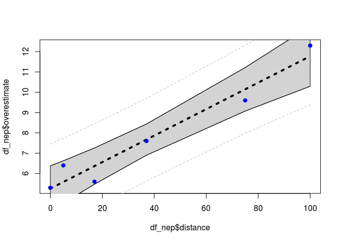
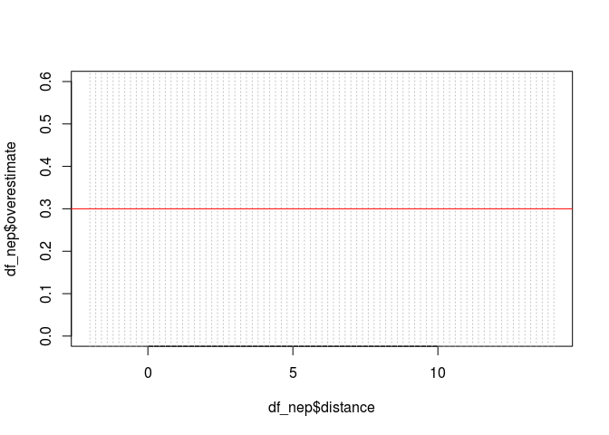
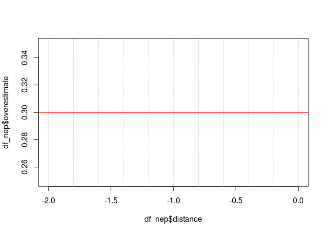
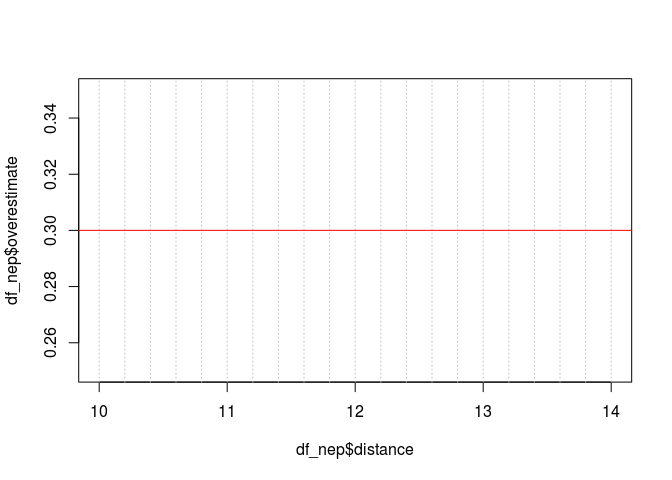
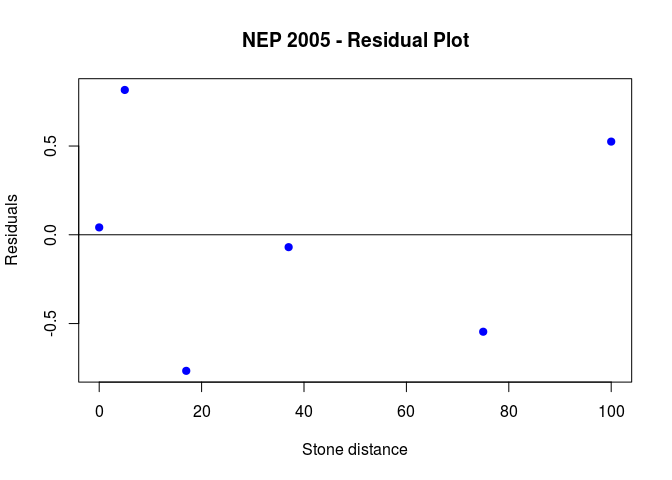
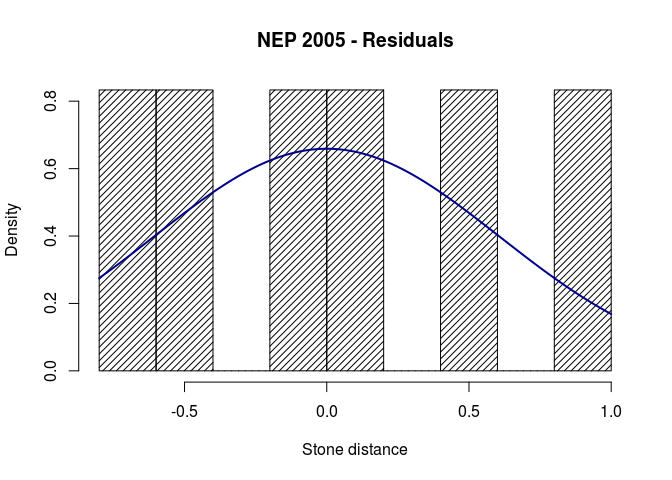

Edison - Mitofsky Election Results
----------------------------------

### Homework 10 - Problem Set

#### b. Analyze the data providing at least the following:

=-=-=-=-=-=-=-=-=-=-=-=-=-=-=-=-=-=-=-=-=-=-=-=-=-=-=-=-=-=-=-=-=-=-=-=--=-=-=-  
i. A Scatterplot with confidence intervals of the regression line and
prediction intervals of the regression line. Please do in SAS and R!  

And the SAS plot ...

=-=-=-=-=-=-=-=-=-=-=-=-=-=-=-=-=-=-=-=-=-=-=-=-=-=-=-=-=-=-=-=-=-=-=-=--=-=-=-  
ii. A table showing the t-statistics and pvalues for the significance of
the regression parameters: . Please do in SAS and R!

    ## 
    ## Call:
    ## lm(formula = overestimate ~ distance, data = df_nep)
    ## 
    ## Residuals:
    ##        1        2        3        4        5        6 
    ##  0.04153  0.81569 -0.76632 -0.06967 -0.54603  0.52479 
    ## 
    ## Coefficients:
    ##             Estimate Std. Error t value Pr(>|t|)    
    ## (Intercept) 5.258470   0.401917  13.083 0.000197 ***
    ## distance    0.065167   0.007483   8.708 0.000957 ***
    ## ---
    ## Signif. codes:  0 '***' 0.001 '**' 0.01 '*' 0.05 '.' 0.1 ' ' 1
    ## 
    ## Residual standard error: 0.6769 on 4 degrees of freedom
    ## Multiple R-squared:  0.9499, Adjusted R-squared:  0.9374 
    ## F-statistic: 75.84 on 1 and 4 DF,  p-value: 0.0009575

And the SAS table ...

=-=-=-=-=-=-=-=-=-=-=-=-=-=-=-=-=-=-=-=-=-=-=-=-=-=-=-=-=-=-=-=-=-=-=-=--=-=-=-  
iii. Using the data in ii show all 6 steps of each hypothesis test.  
=-=-=-=-=-=-=-=-=-=-=-=-=-=-=-=-=-=-=-=-=-=-=-=-=-=-=-=-=-=-=-=-=-=-=-=--=-=-=-

##### **Six-Step Hypothesis Test - Slope**

1: Ho : b1 = 0; Ha ; b1 != 0  
2 : Critical Value : t(0.975, df = **4**) = +/- **2.7764451**  
3 : t = 8.7084782  
4 : p\_value = 9.574970110^{-4} &lt; 0.05 ?  
5: Reject Ho  
6 : There is sufficient evidence to suggest at the alpha = 0.05 level of
significance (p-value = 9.574970110^{-4}) that the slope of the
regression line that estimates the T cell for NEP 2005 based on the
distance of the birds is equal to zero. A 95% confidence interval for
the slope is ( 0.044, 0.086), which is an interval that does not contain
the value zero

##### **Six-Step Hypothesis Test - Intercept**

1 : Ho : b0 = 0; Ha ; b0 != 0  
2 : Critical Value : t(0.975, df = **4**) = +/- **2.7764451**  
3 : t = 13.0834768  
4 : p\_value = 1.970294310^{-4} &lt; 0.05 ?  
5: Reject Ho  
6 : There is sufficient evidence to suggest at the alpha = 0.05 level of
significance (p-value = 1.970294310^{-4}) that the intercept of the
regression line that estimates the T cell for NEP 2005 based on the
distance of the birds is not equal to zero. A 95% confidence interval
for the slope is ( 4.143, 6.374), which is an interval that does not
contain the value zero

=-=-=-=-=-=-=-=-=-=-=-=-=-=-=-=-=-=-=-=-=-=-=-=-=-=-=-=-=-=-=-=-=-=-=-=--=-=-=-  
iv. The regression equation.

The Regression equation : - overestimate = 0.0651674 \* distance +
5.2584698

=-=-=-=-=-=-=-=-=-=-=-=-=-=-=-=-=-=-=-=-=-=-=-=-=-=-=-=-=-=-=-=-=-=-=-=--=-=-=-  
v. Interpretation of the slope and intercept in the model (regression
equation.)

##### The slope represents the rate of change in overestimate estimated for a unit change in stone distance transported by this populations of birds sampled. I.e., for each increase in 1 gram of stone distance there is a corresponding increase in overestimate count of 0.0651674

##### The intercept represents the estimated average level of overestimate counts associated to a transported stone distance of 0 grams by this population of birds. From a practical point of view, since each bird evalauted did actually transport stones of some distance, the intercept provides an estimate of the lower bound of overestimate counts in this population of birds.

=-=-=-=-=-=-=-=-=-=-=-=-=-=-=-=-=-=-=-=-=-=-=-=-=-=-=-=-=-=-=-=-=-=-=-=--=-=-=-  
vi. Find and interpret the 95% confidence interval for the mean t-cell
response conditional on a stone distance of 4.5 grams. Please do in SAS
and R!

And the SAS table ...

The confidence interval is the upper and lower bound for the expected
mean value at the given indpendent value (e.g., distance = 4.5 grams)
for the current regression relationship.

For this particular regression, the confidence interval at stone
distance = 4.5 : overestimate count in the range ( 4.502, 6.602)

=-=-=-=-=-=-=-=-=-=-=-=-=-=-=-=-=-=-=-=-=-=-=-=-=-=-=-=-=-=-=-=-=-=-=-=--=-=-=-  
vii. Find and interpret the 95% prediction interval for the predicted
t-cell response given a stone distance of 4.5 grams. Please do in SAS
and R!

The prediction interval is the upper and lower bound for an 'next'
observation of dependent value at the given independent value, based on
the current regression relationshhip. That is to say, for an observation
of distance and overestimate not included in this analysis, the
prediction interval bounds the range of future observations that are
expected.

For this particular case, the prediction interval at stone distance =
4.5 : overestimate count in the range ( 3.399, 7.704)

=-=-=-=-=-=-=-=-=-=-=-=-=-=-=-=-=-=-=-=-=-=-=-=-=-=-=-=-=-=-=-=-=-=-=-=--=-=-=-  
viii. Using the graphical method, find and interpret the calibration
intervals for the t-cell response of 0.3. (Both for mean t-cell response
and for a single t-cell response. Please do in SAS and R! (R: package
investr)

=-=-=-=-=-=-=-=-=-=-=-=-=-=-=-=-=-=-=-=-=-=-=-=-=-=-=-=-=-=-=-=-=-=-=-=--=-=-=-  
ix. Find the same calibration intervals analytically using the SE
equations given in class and in the book (Version 3 page 194).

    y_est <- 0.3
    x_at_y_est <- (y_est - b0) / b1

    x_at_y_est

    ## (Intercept) 
    ##   -76.08815

    se_at_y_est <- predict(fit_all, data.frame(distance = x_at_y_est), se.fit = TRUE)

    se_ci_at_y_est <- se_at_y_est$se.fit / abs(b1)

    alpha <- 0.05
    dof <- dim(df_nep)[1] - 2
    crit_value <- qt(1 - alpha/2, dim(df_nep)[1] - 2)

    cal_est_at_y_est_upr <- x_at_y_est + crit_value * se_ci_at_y_est
    cal_est_at_y_est_lwr <- x_at_y_est - crit_value * se_ci_at_y_est

    # ...   calibration of predicted value

    res_std_dev <- sigma(fit_all) * sigma(fit_all)

    se_pi_at_y_est <- (sqrt (res_std_dev + se_at_y_est$se.fit * se_at_y_est$se.fit) ) / abs(b1)

    cal_pi_est_at_y_est_upr <- x_at_y_est + crit_value * se_pi_at_y_est
    cal_pi_est_at_y_est_lwr <- x_at_y_est - crit_value * se_pi_at_y_est

=-=-=-=-=-=-=-=-=-=-=-=-=-=-=-=-=-=-=-=-=-=-=-=-=-=-=-=-=-=-=-=-=-=-=-=--=-=-=-  
x. A scatterplot of residuals. Please do in SAS and R!

=-=-=-=-=-=-=-=-=-=-=-=-=-=-=-=-=-=-=-=-=-=-=-=-=-=-=-=-=-=-=-=-=-=-=-=--=-=-=-  
xi. A histogram of residuals with normal distribution superimposed.
(from SAS).

And the SAS plots ...

